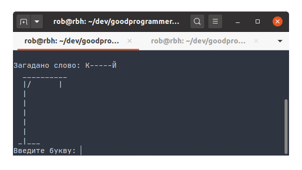

# hangman
Hangman (linguistic game) - training Ruby project.

[Статья в Википедии](https://ru.wikipedia.org/wiki/Виселица_(игра))
	
## Technologies
Ruby

gem colorize adds colors to the game!

## Setup
To run this project, install the Ruby, save project locally using git and run it:

```bash
$ git clone git@github.com:RobBikmansurov/hangman.git
$ cd ./hangman
$ bundle 
$ bundle exec ruby main.rb
```

## Inspiration
Project inspired by great video from goodprogrammer.ru :smile:

## Contact
Created by [Rob Bikmansurov](mailto:robb@mail.ru) - feel free to contact me!

## License
[](https://opensource.org/licenses/MIT)

MIT
see in [LICENSE](LICENSE) file

Copyright &copy; 2020 [Rob Bikmansurov](https://bikmansurov.ru/cv/)

